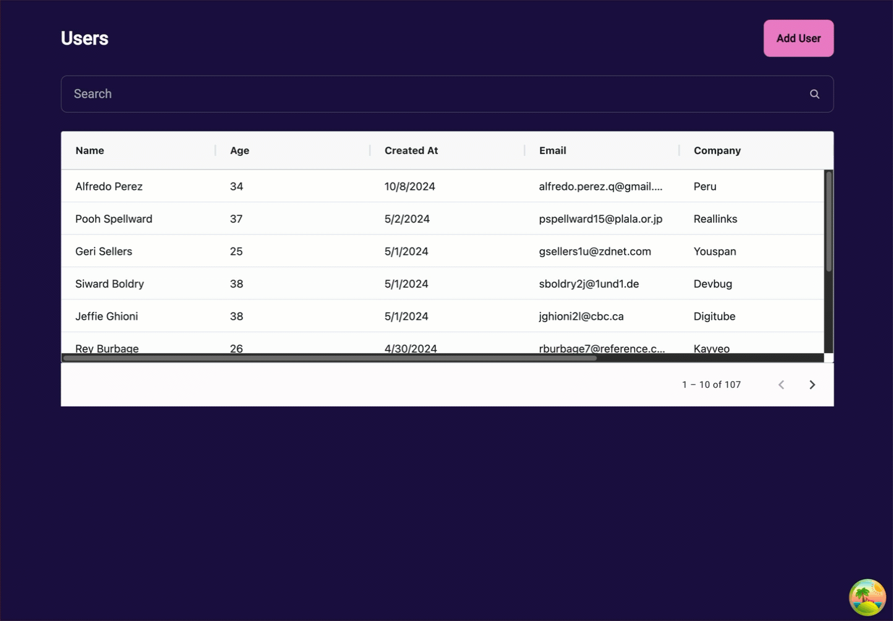

<div align="center">

# 🚀 Angular Query Demo

[](https://angular.io)
[](https://tanstack.com/query/latest)
[](https://opensource.org/licenses/MIT)
[](CONTRIBUTING.md)

Una demostración moderna de gestión de estado en Angular usando Angular Query



</div>

## 🎯 Características

- 📦 Gestión de estado moderna con Angular Query
- 🔄 Caché y sincronización automática
- ⚡ Actualizaciones en tiempo real
- 🎨 UI moderna con Tailwind y DaisyUI
- 📊 Tabla de datos avanzada con AG Grid
- ✅ Testing completo con Web Test Runner
- 📚 Documentación con Storybook

## 🚀 Inicio Rápido

### Prerrequisitos

- Node.js (v18+)
- npm (v9+)

### Instalación

```bash
# Clonar el repositorio
git clone https://github.com/usuario/angular-query-demo.git

# Instalar dependencias
npm install

# Iniciar servidor de desarrollo
npm run start

# En otra terminal, iniciar el servidor mock
npm run server
```

🌐 Visita `http://localhost:4200` en tu navegador

## 📖 Documentación

### Estructura del Proyecto
```
src/
├── app/
│   ├── core/          # Servicios singleton, modelos universales
│   ├── features/      # Módulos de características
│   ├── shared/        # Componentes, pipes y directivas compartidas
│   └── utils/         # Utilidades y helpers
├── assets/
└── environments/
```

### 🛠️ Stack Tecnológico

#### Frontend
- **Angular**: Framework base
- **Angular Query**: Gestión de estado y caché
- **TailwindCSS + DaisyUI**: Estilos modernos
- **AG Grid**: Tablas de datos avanzadas

#### Desarrollo
- **TypeScript**: Tipado estático
- **JSON Server**: API mock
- **ESLint + Prettier**: Calidad de código

#### Testing
- **Web Test Runner**: Testing moderno
- **ng-mocks**: Utilidades de testing
- **Storybook**: Desarrollo de componentes

## 📱 Capturas de Pantalla

<div align="center">


</div>

## 🤝 Contribución

¡Las contribuciones son bienvenidas! Por favor lee nuestra [guía de contribución](CONTRIBUTING.md).

### Pasos para contribuir

1. Fork del repositorio
2. Crea tu rama de feature
   ```bash
   git checkout -b feature/AmazingFeature
   ```
3. Commit tus cambios
   ```bash
   git commit -m 'Add: AmazingFeature'
   ```
4. Push a la rama
   ```bash
   git push origin feature/AmazingFeature
   ```
5. Abre un Pull Request

## 📜 Scripts Disponibles

| Comando | Descripción |
|---------|-------------|
| `npm start` | Inicia el servidor de desarrollo |
| `npm run build` | Construye la aplicación para producción |
| `npm test` | Ejecuta los tests unitarios |
| `npm run server` | Inicia el servidor JSON mock |
| `npm run storybook` | Inicia Storybook |

## 📝 Licencia

Este proyecto está bajo la Licencia MIT - ver el archivo [LICENSE](LICENSE) para más detalles.


---

<div align="center">

Hecho con ❤️ para la comunidad Angular

[⬆ Volver arriba](#angular-query-demo)

</div>
